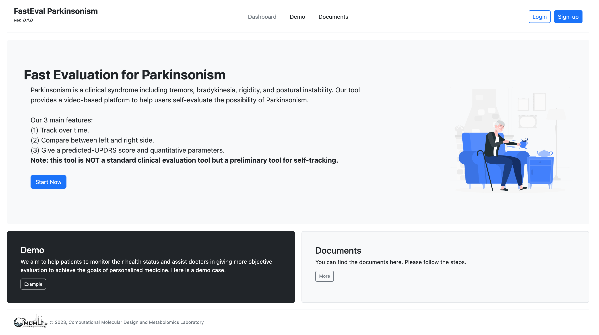

# FastEval Parkinsonism

## Fast Installation at local by docker-compose
```bash
git clone <github-link>
# e.g. git clone git@github.com:CMDM-Lab/fasteval_parkinsonism.git
docker-compose up --build # for building
docker-compose down # for stop or ctrl+C
docker-compose up # for reactivate
```
## Show
Open your browser and use the `https://localhost:13006`

## Hand Predictor API
Read the document for indenpendently usage ([Hand Predictor API](./src/lib/hand_predictor/README.md)).

***
# Other informations
## \[Alternative 1\] Fast Installation by docker
```bash
git clone <github-link>
docker build -t "yuy/fasteval_parkinsonism:v0.1.0" -f Dockerfile.backup .
docker run -p 13006:13006 yuy/fasteval_parkinsonism:v0.1.0
```
### Start 
```bash
cd src

# activate redis
# redis-server  ## packed into foreman
# activate sidekiq
# bundle exec sidekiq ## packed into foreman
# activate webserver
# bin/rails s -p  ## packed into foreman

# use formeman to start redis, sidekiq, webserver simutaneously
foreman s -f Procfile.backup # or `foreman start -f Procfile.backup `

```

## \[Alternative 2\] Manual Installation
### Docker for ruby
```bash
# pull
docker pull ruby:3.1.2

# create container from image
docker run -it -v <original path>:<inside conatainer path> ruby:3.1.2 /bin/bash

# [if the container have been contructed] start container
docker start <Container ID> 

# [if the container is currently running] exec codes with container
docker exec -it -w /root <Container ID> /bin/bash

# [if the container is currently running] 2. attach to container
docker attach <Container ID>
```

### Install rails and squilte3
```bash
gem install rails # install rails
apt update # update pkgs
apt upgrade # upgrade pkgs
apt install sqlite3 # install sqlite3

# install ffmpeg
apt install ffmpeg -y

# install zip
apt install zip

# REDIS: https://redis.io/docs/getting-started/installation/install-redis-on-linux/
# lsb-release, redis (sidekiq)
apt install lsb-release
curl -fsSL https://packages.redis.io/gpg | gpg --dearmor -o /usr/share/keyrings/redis-archive-keyring.gpg
echo "deb [signed-by=/usr/share/keyrings/redis-archive-keyring.gpg] https://packages.redis.io/deb $(lsb_release -cs) main" | tee /etc/apt/sources.list.d/redis.list
apt-get update
apt-get install redis
#run: redis-server
#test: redis-cli
```

### Miniconda environment & mediapipe env
```bash
# download
wget https://repo.anaconda.com/miniconda/Miniconda3-py38_4.12.0-Linux-x86_64.sh
bash Miniconda3-py38_4.12.0-Linux-x86_64.sh 

# conda 
conda env create -f environment.yml 
conda activate mediapipe

# python open-cv pkg
apt-get install python3-opencv
```

### Start 
```bash
cd src

# activate redis
# redis-server  ## packed into foreman
# activate sidekiq
# bundle exec sidekiq ## packed into foreman
# activate webserver
# bin/rails s -p  ## packed into foreman

# use formeman to start redis, sidekiq, webserver simutaneously
foreman s -f Procfile.backup # or `foreman start -f Procfile.backup `

```

